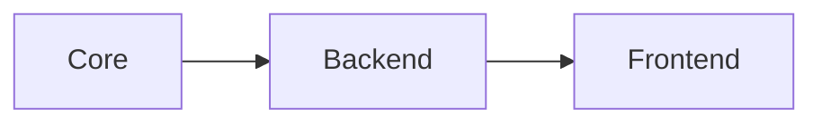

# Building with Actix Web and Leptos

バックエンドの API と静的配信を Actix Web で受け持ち、フロントエンドの描画は Leptos で構成する形を試しています。

## 最小ルーティング

- `/health`
- `/posts`
- `/posts/{slug}`
- `/`
- `/p/{slug}`

## いま見ているポイント

- Actix を API と配信の境界に置く
- Leptos を UI と HTML 生成に使う
- Chart 用 CSV をメタデータから読み込んで描画する

このページでは chart を SVG と table の両方で確認し、記事本文に Mermaid 図も混ぜられるようにしています。

## Mermaid preview

